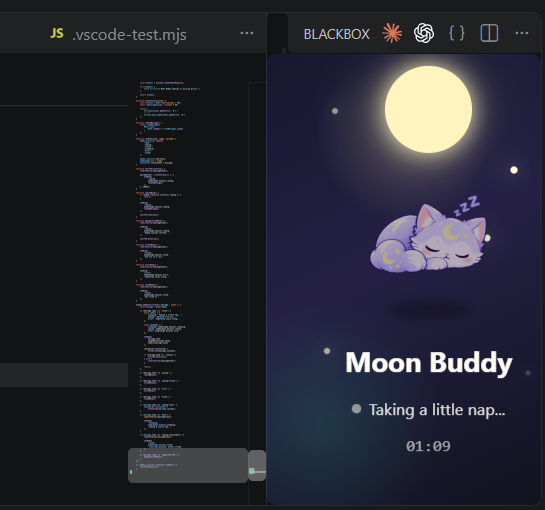

# 🌙 Moon Buddy

A tiny coding companion that lives inside VS Code and reacts to your coding journey.

Moon Buddy watches your activity, celebrates your progress, and takes a little nap when you do. 🐱✨

## ✨ Features

- 🐱 Cute animated coding companion
- 💻 Detects when you're coding
- ⏱️ Tracks your coding session
- 🌟 Celebrates coding streaks
- 😵 Reacts when your code has an error
- ✨ Celebrates when you fix an error
- 🚀 Reacts when you start a debug session
- 💬 Random encouraging messages
- 😴 Takes a nap when you stop coding

## 🌙 How it works

Open the Command Palette:

`Ctrl + Shift + P`

Then search:

`Moon Buddy: Open`

Keep coding and Moon Buddy will react to what you're doing.

## 🐾 Mood System

| Mood | Reaction |
|------|----------|
| 💻 Coding | Watches you code |
| 😵 Error | Gets worried |
| ✨ Fixed | Celebrates |
| 🚀 Success | Celebrates your run |
| 🌟 Streak | Celebrates your coding session |
| 😴 Idle | Takes a nap |

## 🛠️ Built With

- TypeScript
- JavaScript
- HTML
- CSS
- VS Code Extension API

## 🚀 Development

Clone the repository and install dependencies:

```bash
npm install

Compile the extension:

npm run compile
 
Press F5 in VS Code to launch the Extension Development Host.

## Preview



💜 Why Moon Buddy?

Coding can get lonely.

So I wanted to build a tiny companion that makes the editor feel a little more alive.

Made with 💜 and too many lines of code.


Save it.
